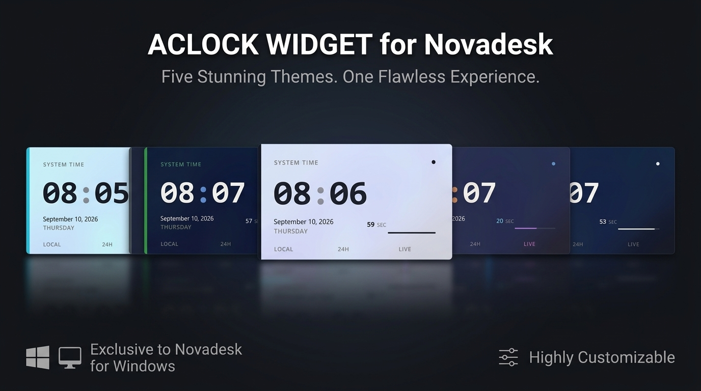

<h1 align="center">AClock</h1>

<p align="center">
  A sleek, modern acrylic digital clock widget for Novadesk.
</p>

<p align="center">
  
  
  
  
</p>

<p align="center">
  
</p>

## About

**AClock** is an acrylic digital clock desktop widget built for [Novadesk](https://novadesk.pages.dev/). It brings clean typography, live time, date, and animated seconds progress to your desktop while seamlessly integrating with modern Windows aesthetics.

### Features

- **Digital Time Display**: Crisp hours and minutes with styled colon separator.
- **12H / 24H Toggle**: Easily switch between 12-hour format (with AM/PM indicator) and 24-hour format.
- **Date & Day Info**: Displays full date (Month Day, Year) and current day of the week.
- **Live Seconds Progress**: Live numerical seconds counter accompanied by an animated progress bar (0-60s).
- **5 Built-in Themes**: Choose between Dark, White, GitHub, Dracula, and Material UI.
- **Backdrop Blur Effects**: Supports Acrylic, Blur (BlurBehind), and None (solid).
- **Window Corner Styles**: Choose from Round Small, Round, or None (square).
- **Custom Scaling**: Scale effortlessly between 75%, 100%, 125%, 150%, 175%, and 200%.
- **Context Menu Controls**: Access all customization options instantly by right-clicking the widget.
- **Desktop Integration**: Fully draggable, edge snapping, and automatically remembers your settings.

## Requirements

- Windows 10 or later
- [Novadesk](https://novadesk.pages.dev/)
- The bundled `BlurBehind` Novadesk add-on (for Acrylic and Blur effects)

## Download

Download the latest widget package (`.ndpkg`) from the project releases:

[Download AClock_v1.0.0.0.ndpkg](https://github.com/NSTechBytes/AClock/releases)

Double-click the downloaded `.ndpkg` file to install it directly with Novadesk. Novadesk must be installed before opening the package.

## Run from source

Clone or download this folder, then start it through the Novadesk Widget Manager:

```powershell
cd D:\Novadesk-Project\AClock
nwm run
```

The project entry point is `index.js`. If your Novadesk executable is in a different location, use the Widget Manager configuration or start Novadesk with this file as its script.

## Settings & Controls

All widget settings can be configured at any time by right-clicking on the widget:

| Option | Values / Actions | Description |
|---|---|---|
| **Time Format** | 12-Hour / 24-Hour | Toggles between 12H (with AM/PM badge) and 24H military format |
| **Theme** | Dark, White, GitHub, Dracula, Material UI | Changes the background card, text, and accent colors |
| **Scale** | 75%, 100%, 125%, 150%, 175%, 200% | Dynamically scales widget dimensions and fonts |
| **Blur Effect** | Acrylic, Blur, None | Controls window backdrop transparency and blur effect |
| **Corners** | Round Small, Round, None | Sets the window corner rounding style |
| **Reload Widget** | Action | Refreshes the widget UI |
| **Close AClock** | Action | Exits the clock widget |

Settings are automatically saved across sessions using Novadesk's persistent storage (`app.storage`).

## Patreon

If AClock is useful to you, supporting the project on [Patreon](https://patreon.com/cw/nstechbytes) helps cover the time spent maintaining widgets, adding new features, and testing new Novadesk releases. Support is optional, but it makes continued work on the project possible.

## License

AClock is licensed under the [Apache License 2.0](LICENSE).
